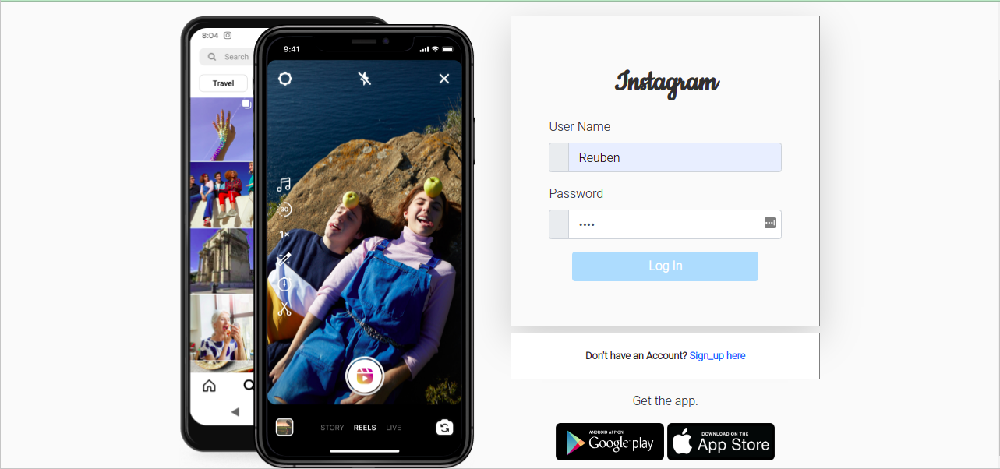

# Instagram Clone

#### By Reuben Kipkemboi

## Table of Content

+ [Description](#description)
+ [Installation Requirement](#installation-requirements)
+ [Technology Used](#technologies-used)
+ [License](#license)
+ [Authors Info](#authors-info)

## Description
a clone of the website for the popular photo app Instagram.The application resembles instagram in that users register to the application make posts and also see post made by other users.Upon registration user receives na invitation email.User can make a like on the posts that have impressed them.

[Go Back to the top](#instagram-clone)


## User Stories

User Can :-

* Sign in to the application to start using.
* Upload my pictures to the application.
* See my profile with all my pictures.
* Follow other users and see their pictures on my timeline.
* Like a picture and leave a comment on it.

[Go Back to the top](#instagram-clone)

Registration


Login



Create Post


## Behaviour Driven Development
| Behaviour | Input | Output |
| :---------------- | :---------------: | ------------------: |
| Application starts | **On page load** | Login page for user to login |
| Registration| **Registration form** | News users register to the application and are redirected to login |
| Image click | **Image click** | Modal appears with the post details and description and a like button|
| Like Icon click | **Like Icon click** | Makes a like therefore on click means user liked the post|
| Addition icon click | **Addition Icon click** | Once user is logged in , an icon in the navbar where user can create a post|


## Installation Requirements

### Prerequisites

- Django
- Pip & Python
- cloudinary 
- Postgres Database

## Instructions

To use this gallery project .......  
  
##### Clone Repository:  
 ```bash 
https://github.com/Reuben-Kipkemboi/Instagram-clone.git 
```
##### Install and activate Virtual Environment virtual  
 ```bash 
cd <projectname> && python3 -m venv virtual && source virtual/bin/activate 
```  
##### Install Dependencies  
 ```bash 
 pip install -r requirements.txt 
```  
##### Setup Database  
  SetUp Database User,Password, Host then following Command  

 ```bash 
python manage.py makemigrations  
 ``` 
 Now Migrate

 ```bash 
 python manage.py migrate 
```
##### Run Application  
 ```bash 
 python3 manage.py runserver 

 or
 ./manage.py runserver
```
##### Test Application  
 ```bash 
 python manage.py test <appname>
```
Open the application on your browser `127.0.0.1:8000`.  

[Go Back to the top](#instagram-clone)


## Technologies Used


## License
[](https://opensource.org/licenses/MIT)

[MIT License](LICENSE)

## Live Site

#### https://insta-by-reuby.herokuapp.com/


## Author's Info

* :email: [Reuben Kipkemboi](https://gmail.com)  

<p align = "center">
    &copy; 2022 @Reuben Kipkemboi.
</p>